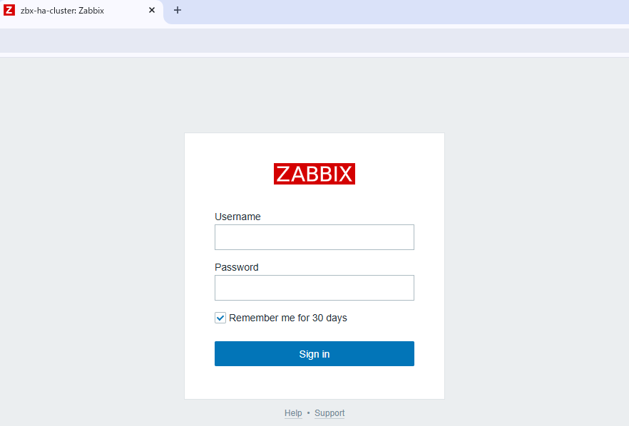
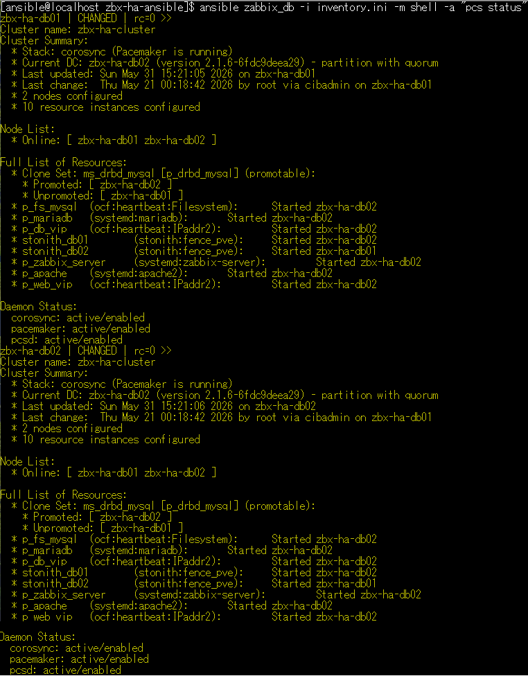
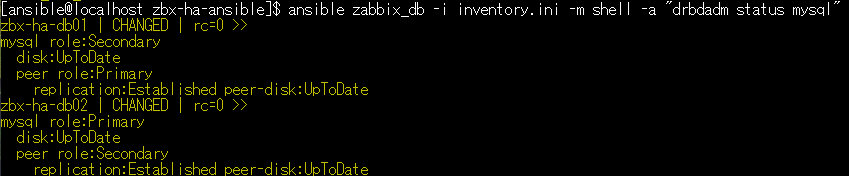
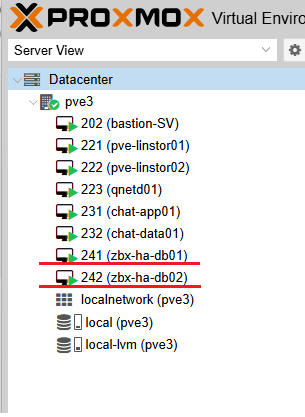
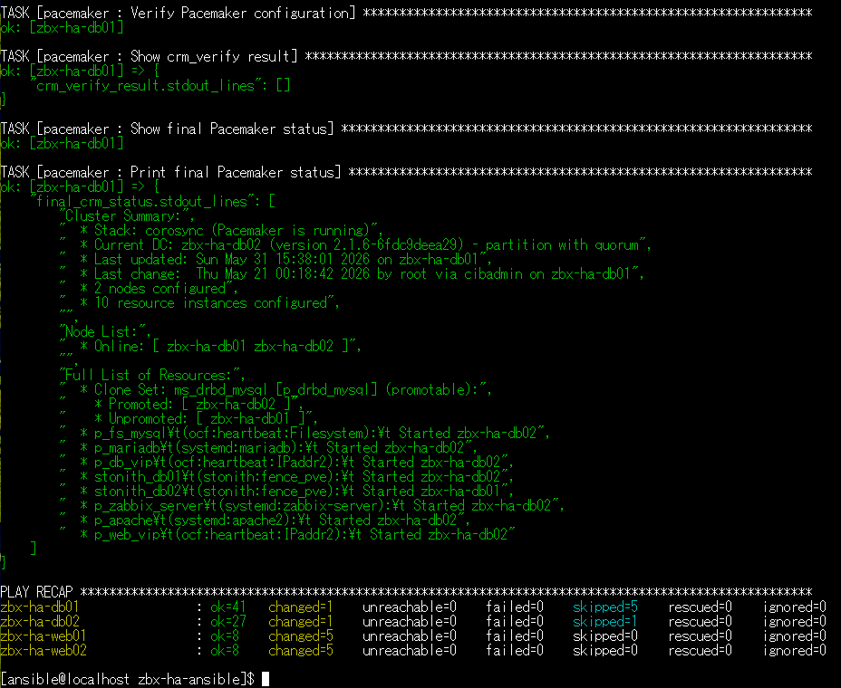
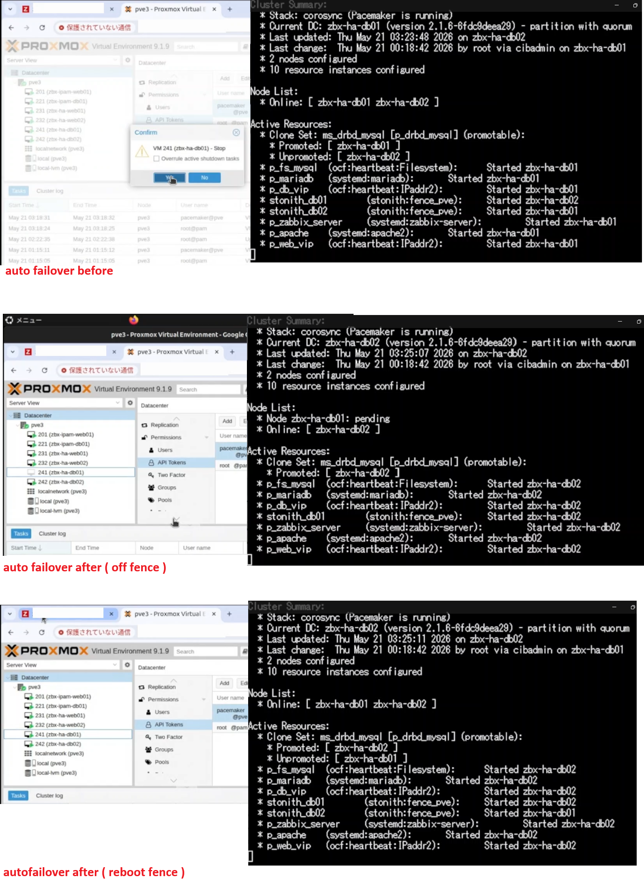

# Zabbix HA Ansible Lab

## Overview

This repository is an Ansible portfolio project for building a Zabbix high availability lab environment.

The project demonstrates Linux infrastructure automation using Ansible, Pacemaker, Corosync, DRBD, MariaDB, Apache, Zabbix, and fencing configuration.

The main purpose of this lab is to verify how a Zabbix monitoring platform can be deployed with HA components and how failover behavior can be tested in a controlled environment.

## Architecture / Screenshot

## Screenshots

### Zabbix Web Login

### Pacemaker Cluster Status

### DRBD Replication Status

### Proxmox VM List

### Ansible Playbook Result

### Auto Failover Test

The screenshot above shows the Zabbix web login page and Pacemaker cluster status during HA verification.

## Nodes
Role	Hostname	IP Address
DB / HA node 1	zbx-ha-db01	192.168.56.111
DB / HA node 2	zbx-ha-db02	192.168.56.112
Zabbix Web VIP	-	192.168.56.113
DB VIP	-	192.168.56.114
BMC db01	-	192.168.56.121
BMC db02	-	192.168.56.122

## DB HA Components

- Corosync
- Pacemaker
- DRBD
- MariaDB
- Apache
- Zabbix Server
- IPaddr2 DB VIP
- IPaadr2 Web VIP
- STONITH fencing

## Fencing:
- Proxmox fence_pve is replaced by BMC fencing.
- Default agent: fence_ipmilan
- stonith-action: off / reboot

## Build order

1. Run common role
2. Run DRBD role
3. Run init_drbd.yml only once
4. Run mysql_ha role
5. Run pacemaker.yml
6. Run verify.yml

## Failover Test

A failover verification video is available below.

For security reasons, IP addresses, hostnames, and URLs may be masked in the video.

[Watch failover test video](https://drive.google.com/file/d/https://drive.google.com/file/d/1skCBJQ_tI3S5SaWsgw6MHqnHZf06FmPf/view?usp=sharing)

The failover test verifies:

- Pacemaker cluster role transition
- DRBD Primary / Secondary state
- MariaDB resource behavior
- Zabbix Server and Apache service status
- VIP movement and service recovery

## Important note

STONITH is currently disabled for lab verification.

stonith-enabled=false

This repository is intended for learning, lab verification, and portfolio demonstration.
